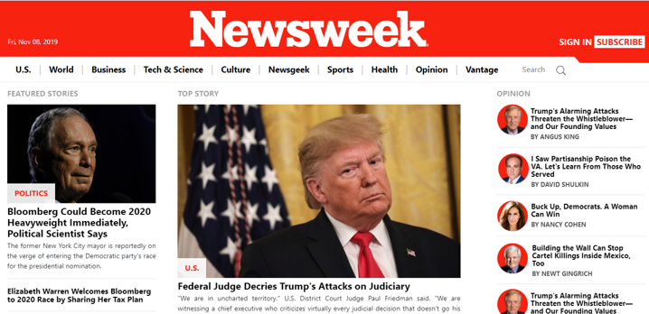
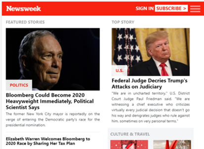
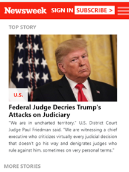

<!--
*** Thanks for checking out this README Template. 
-->

<!-- PROJECT TITLE -->

 
<h1 align="center">Using Bootstrap</h1>

    Clone the site Newsweek.com
     

<!-- TABLE OF CONTENTS -->

## Table of Contents

* [About the Project](#about-the-project)
  * [Built With](#built-with)
* [Getting Started](#getting-started)
* [License](#license)
* [Contact](#contact)
* [Acknowledgements](#acknowledgements)

<!-- ABOUT THE PROJECT -->
## About The Project

#### In this project, you’ll get a chance to try out Twitter’s Bootstrap framework by building a site that actually uses it – Newsweek (https://www.newsweek.com/).

##### You can find the original project specification at: https://www.theodinproject.com/courses/html5-and-css3/lessons/using-bootstrap

  
## Desktop size

  
## Tablet size

  
## Mobile size

 

### Built With 

* HTML 
* CSS3
* Bootstrap 
* Github

<!-- GETTING STARTED -->
## Getting Started

Just clone or download the project and open the index.html in your browser. 

<!-- LICENSE -->
## License

Distributed under the MIT License. See `LICENSE` for more information.

<!-- CONTACT -->
## Contact
* Felipe Enne - felipeenne@gmail.com 

<!-- ACKNOWLEDGEMENTS -->
## Acknowledgements

* Microverse.

